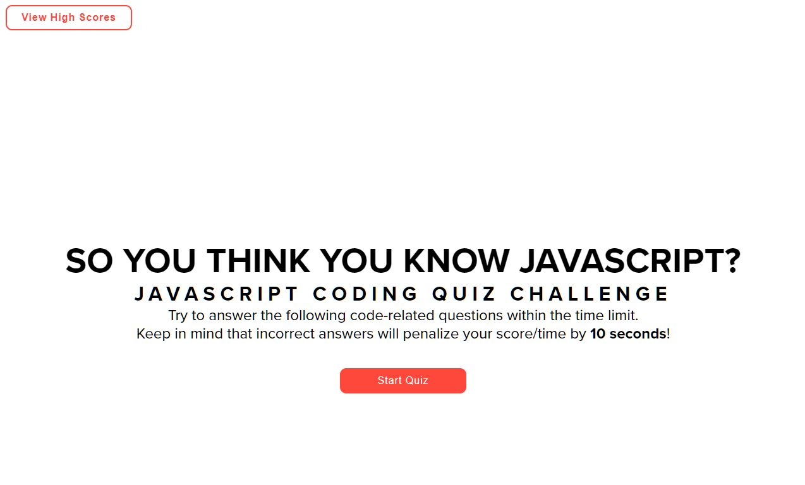
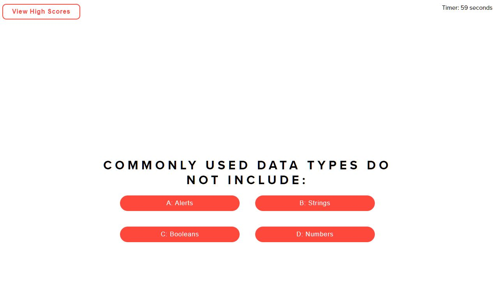

# Coding Quiz

## Table of Contents
* [Description](#description)
* [The Challenge](#challenge)
* [The Criteria](#criteria)
* [Final Result](#results)
* [Reflection](#reflection)

## Description 
This JavaScript coding quiz was created as the fourth assigment for my coding Bootcamp.

 

## The Challenge 
Create a timed quiz on JavaScript fundamentals that stores high scores.

## The Criteria 
1. When start button is clicked a timer starts and the user is presented with a question.
1. When a question is answered another one is presented.
1. If the user answers incorrectly, time is subtracted from the clock.
1. When all questions are answered or the timer hits zero, game over.
1. On game over, the user is prompted to submit their initials and score.

## Final Result 
The final generator can be viewed at [https://ianjacksondesign.com/coding-quiz/](https://ianjacksondesign.com/coding-quiz/)

## Reflection 
This looked so simple, but it was the most time consuming and hardest project so far. JavaScript is showing itself to be the hardest of the core web design languages, but I can see why it's so important. It took a lot of referencing the module lessons, class assignments, and Google to complete this assignment and even then it's not as good as it could be.

It hits all the criteria requirements, but there's some bugs that I'm not quite sure how to work out. That being said though, I am extremely proud of this, bugs and all, just because it was such a challenge. It really forced me to think and got my brain firing. I like to think I have a better understanding of JS after this, but I think only time will tell whether it sticks or not.